# Big Data Analytics Technologies - Technical Report

## Overview
This technical report summarizes the implementation and deployment details for the tasks completed as part of the Big Data Analytics Technologies coursework. The project establishes containerized data pipelines covering time-series databases, real-time stream processing, distributed batch processing, graph databases, and theoretical data governance. While the services are containerized, they are primarily single-instance deployments intended for local verification rather than production-scale, distributed high-availability environments. The Task 1 importer reports execution-specific throughput, but no controlled latency measurements, scaling comparisons, or failover tests were conducted.

## Verification Run and Final State

Tasks 1–4 were reverified locally on 29 August 2026 using Docker Desktop 29.7.2, Docker Compose 5.4.0, WSL 2.7.12, 12 logical CPUs, and approximately 7.57 GiB of Docker memory. The stacks were run sequentially to avoid memory contention. Generated data, JARs, event logs, database files, metrics, and query results remain ignored by Git.

| Task | Result | Fresh verification evidence | State after verification |
|---|---|---|---|
| 1 — InfluxDB | PASS | 96,453 rows processed; 96,429 stored temperature points; all three Flux operations passed | InfluxDB stopped; bind-mounted database retained |
| 2 — Kafka/Flink | PASS | Three Kafka partitions, one three-slot TaskManager, RUNNING job, and completed live 15-minute sensor totals | Containers/network removed after verification; JAR/images retained |
| 3 — Spark | PASS | 7,600,595 edges, 50 ranked rows, two workers, non-zero shuffle, History Server entry | Spark services stopped; dataset/output/metrics/events retained |
| 4 — Neo4j | PASS | 5,000 relationships, three PROFILE analyses, 23 neighbours, six-hop path | Neo4j stopped cleanly; generated CSV/results retained |

## Task 1: Distributed Time-Series Data Management using InfluxDB (week 1)
**Objective:** Design, provision, and evaluate a high-throughput time-series database architecture using InfluxDB inside a containerized topology. Students will master time-series schema structuring, bucket retention optimization, and functional metric querying.

### Architecture & Deployment
The system was deployed using the single autonomous InfluxDB 2.7.12 container specified by the coursework and configured via Docker Compose (`task1-influxdb/docker-compose.yml`). The environment bootstrapped organization and bucket structures upon initialization using hardcoded credentials.

### Data Ingestion
A Python ingestion script (`task1-influxdb/ingest/ingest.py`) parses the public Weather in Szeged CSV dataset. It translates records into the InfluxDB Line Protocol, converts the original timezone-aware timestamps to UTC, and pushes the data into the database. The importer processes 96,453 source rows, leaving 96,429 distinct temperature points after duplicate point identities are overwritten, and reports execution-specific pipeline and database-write throughput.

### Analytical Querying
Three Flux scripts were authored to perform historical and scheduled analytical operations:

1. **Sliding Hourly Average (`01_sliding_hourly_average.flux`):** Computes a one-hour temperature mean every 15 minutes.
2. **Anomaly Detection (`02_two_sigma_anomalies.flux`):** Captures climate observations more than two population standard deviations from the dataset mean.
3. **Continuous Downsampling (`03_continuous_downsample.flux`):** Summarizes the preceding hour of data into an auxiliary bucket that retains data for 30 days. Because it only queries the last hour using `range(start: -task.every)` and the source dataset ends in 2016, it does not backfill historical data.

### Fresh Verification Results

| Check | Result |
|---|---:|
| Source rows processed | 96,453 |
| Distinct stored `temperature_c` points | 96,429 |
| Sliding one-hour averages at 15-minute intervals | 385,716 |
| Observations outside strict two-sigma limits | 3,328 |
| Synchronous InfluxDB write throughput | 68,883 records/s over 1.400 s |
| End-to-end download/parse/write throughput | 6,216 records/s over 15.517 s |
| Sliding-average Flux execution time | 15.728 s |
| Two-sigma Flux execution time | 3.534 s |
| Downsample Flux execution time | 0.338 s |
| Downsample task | `climate-hourly-downsample-30d`, active every 1 h |
| Auxiliary bucket retention | 720 h (30 days) |

The rerun was idempotent: importing the same timestamp/tag identities did not increase the 96,429-point count. Throughput and elapsed time are observations from this host, not controlled scalability benchmarks.

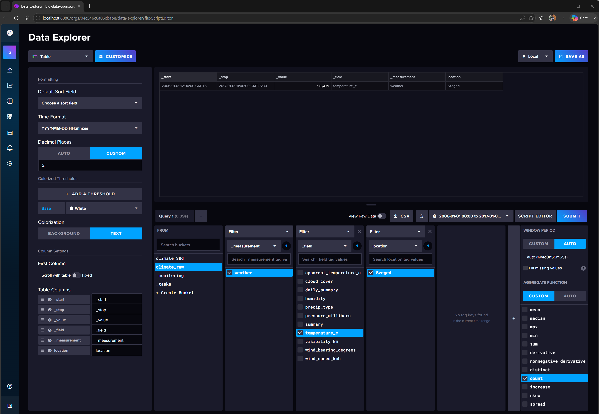

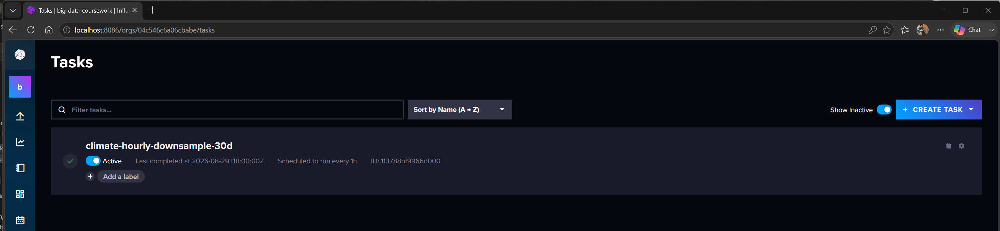

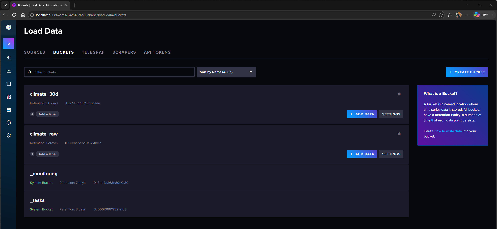

---

## Task 2: Real-Time Stream Ingestion & Processing with Kafka and Flink
**Objective:** Construct a localized stream processing infrastructure.

### Architecture & Deployment
The topology is built on a Docker Compose landscape (`task2-kafka-flink/docker-compose.yml`) containing:

- One Apache Kafka broker node using `PLAINTEXT` communication and a replication factor of 1.
- One Apache Flink JobManager node.
- One Apache Flink TaskManager node.

### Live Simulation
A Python producer application (`task2-kafka-flink/producer/producer.py`) sequentially replays historical Austin camera traffic-count records and pushes them into a 3-partition Kafka topic (`traffic-telemetry`) every 2 seconds.

### Stateful Flink Processing
A Java-based Flink job (`com.coursework.TrafficWindowJob`) consumes the Kafka stream. It utilizes a `Bounded-OutOf-Orderness` watermarking strategy with a 10-second tolerance for out-of-sequence events. Records arriving behind the watermark are dropped by default, as no `allowedLateness` or late-data side output is configured. The pipeline employs a 15-minute tumbling event-time window to produce non-overlapping vehicle-count totals per sensor. The retained TaskManager evidence shows completed windows for sensor `6171`, including a visible total of 279 vehicles.

### Fresh Verification Results

| Check | Result |
|---|---:|
| Shaded Flink JAR size | 20,105,907 bytes |
| Kafka topic | `traffic-telemetry` |
| Kafka partitions / replication factor | 3 / 1 |
| Flink TaskManagers / total slots | 1 / 3 |
| Submitted job state | `RUNNING` |
| Dashboard job ID | `49452853a21a169172b51c412f8c22bc` |
| Window operator records received | 338 |
| Visible output sensor | `6171` |
| Example visible 15-minute total | 279 |

The dashboard evidence records job `49452853a21a169172b51c412f8c22bc` in the `RUNNING` state with parallelism three and 338 records received by the window operator. The retained TaskManager log screenshot shows structured JSON totals whose window start and end timestamps differ by 900,000 milliseconds, confirming completed 15-minute event-time windows. These screenshots were captured during repeated verification runs and therefore document the deployed topology and observable output without claiming that every figure belongs to one job execution. The Task 2 containers and container-local Kafka data were removed after verification; the rebuilt JAR and Docker images remain cached.

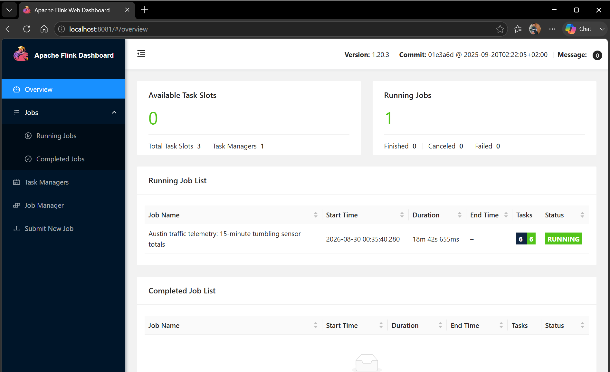

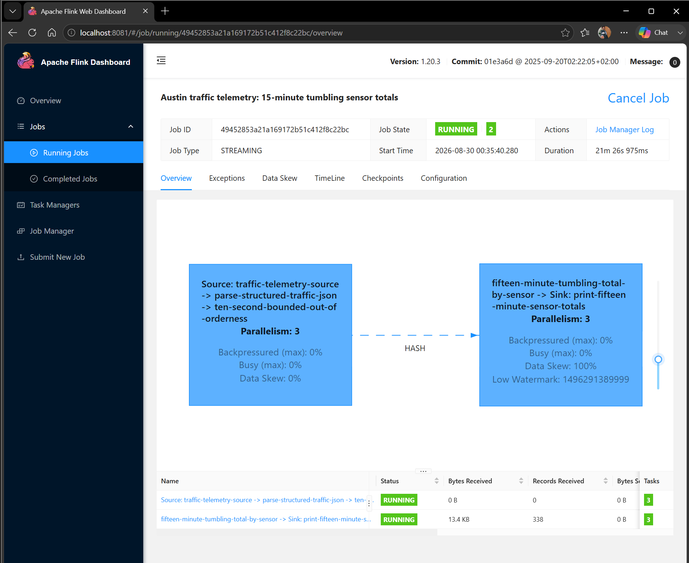

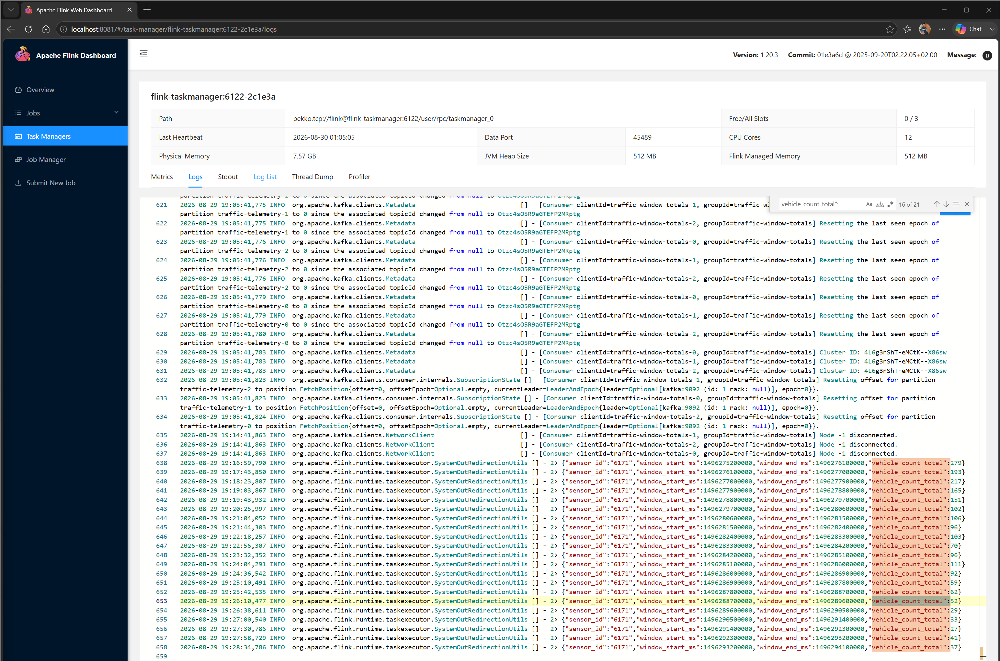

---

## Task 3: Scalable Data Analytics with Apache Spark
**Objective:** Handle large-scale graph-data aggregation over Spark compute nodes.

### Architecture & Deployment
A Spark cluster was orchestrated via Docker Compose (`task3-spark/docker-compose.yml`). The setup includes one Master node and two independent Worker nodes, all running on a single host. Resource constraints were applied (e.g., maximum compute cores and RAM allocation).

### PySpark Job Implementation
The data processing logic (`task3-spark/apps/analyze_graph.py`) processes the 7,600,595-edge SNAP network text dataset. The script parses the text into Spark DataFrames, computes one in-degree count per destination vertex, and orders those counts to return the top 50 nodes.

### Metrics Tracking
The job was submitted using `spark-submit`. Captured metrics (`metrics/execution-metrics.json`) link SQL executions to jobs, stages, and RDD lineage; retain the initial and adaptive Spark SQL physical plans as structured operator DAGs; and record stage durations, per-worker allocation, and shuffle read/write bytes. The retained metrics record two workers, 22 RDD nodes with 21 lineage edges, two SQL executions with 21 initial operators, and 5,652,839 bytes each of total shuffle read and shuffle write.

### Fresh Verification Results

| Check | Result |
|---|---:|
| Fresh application ID | `app-20260829194102-0000` |
| Parsed directed edges | 7,600,595 |
| Ranked output rows | 50 |
| Highest-ranked destination / in-degree | `438238` / `84208` |
| Live workers | 2 |
| Resources per worker | 2 cores / 2048 MiB |
| Completed jobs | 5 |
| Stage nodes / dependency edges | 7 / 2 |
| RDD nodes / lineage edges | 22 / 21 |
| SQL executions / initial operators | 2 / 21 |
| Adaptive SQL plan updates | 6 |
| Total shuffle read / write | 5,652,839 / 5,652,839 bytes |

Both workers performed work: the fresh metrics assigned eight tasks to `spark-worker-2` and nine tasks to `spark-worker-1`. The Master API reported exactly two `ALIVE` workers, and the History Server exposed the completed fresh application before the stack was stopped.

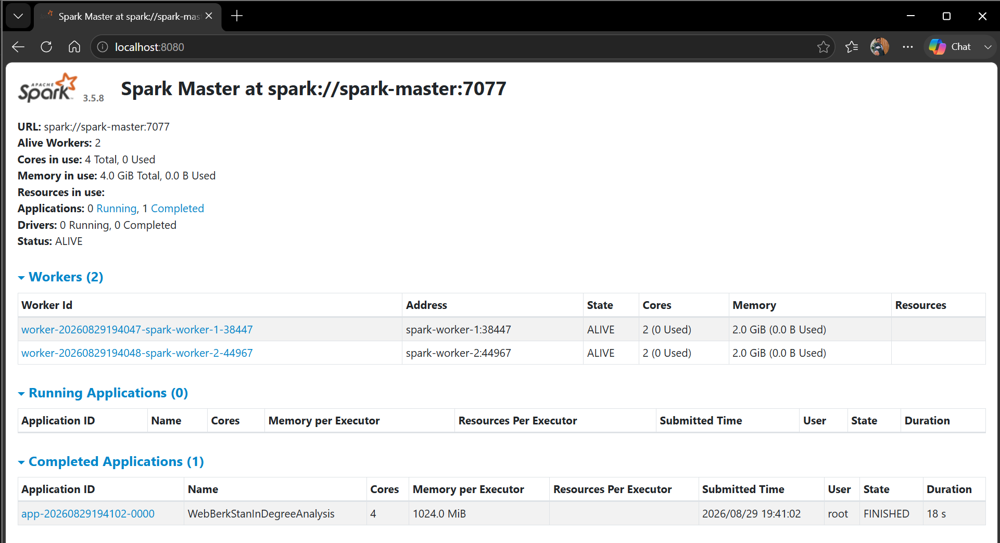

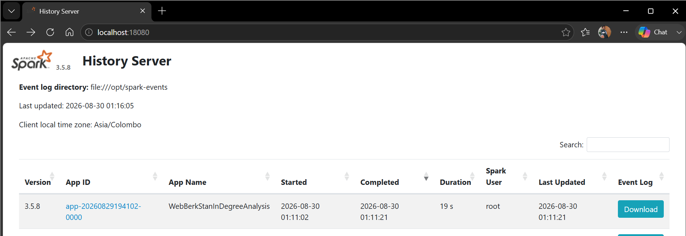

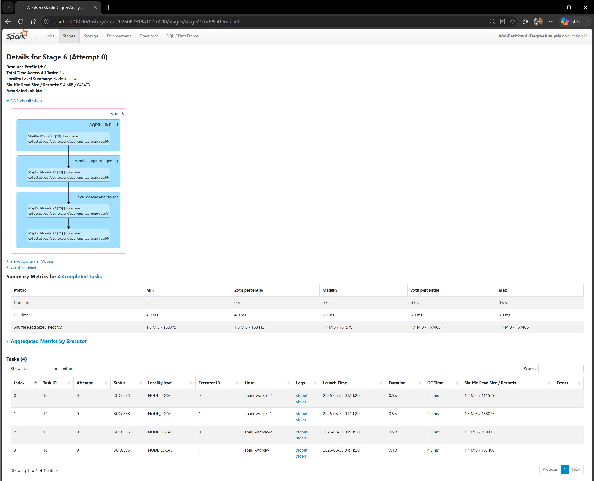

---

## Task 4: Graph Database Engineering using Neo4j
**Objective:** Develop graph-native storage structures and run node lookups.

### Architecture & Deployment
A single Neo4j Community Edition instance was spun up via Docker Compose (`task4-neo4j/docker-compose.yml`). The container exposed HTTP and Bolt ports without TLS. Password authentication was enabled, but Neo4j's `/data` directory was not mounted, causing the database to disappear after the container is removed.

### Graph Ingestion
Using Cypher's `LOAD CSV` mechanism and `MERGE` statements (`task4-neo4j/cypher/import_patents.cypher`), the first 5,000 directed citation edges (with citing patent IDs covering `3858241–3859217`) from the SNAP patent dataset were imported into the graph.

### Network Analytics
Cypher queries (`task4-neo4j/cypher/analysis_queries.cypher`) were formulated to analyze the subset graph structure:

1. A one-hop, direction-agnostic neighborhood query around patent `3858514`.
2. One subset in-degree ranking to discover patents with incoming citations within the subset, where the maximum observed in-degree is 4.
3. One undirected six-hop shortest path between patents `3484134` and `253889`.

### Fresh Verification Results

| Check | Result |
|---|---:|
| Prepared/imported `CITES` relationships | 5,000 |
| Direct neighbours of patent `3858514` | 23 |
| Highest observed subset in-degree | 4 |
| Patents tied at in-degree 4 | `3284344`, `3308054`, `3338819`, `3717571` |
| Shortest-path hop count | 6 |
| PROFILE statements/results | 3 |
| Saved analysis-output size | 17,133 bytes |
| Neo4j Browser HTTP status | 200 |

The verified shortest path was `[3484134, 3858825, 3635420, 3858826, 3741496, 3858824, 253889]`. The prepared subset is retained in `task4-neo4j/import/patent_edges_5000.csv`, and the three saved result/plan sections are retained in `task4-neo4j/results/query-execution.txt`. Neo4j's `/data` directory remains container-local, so removing the Neo4j container deletes the imported graph even though the prepared CSV and saved analysis output survive.

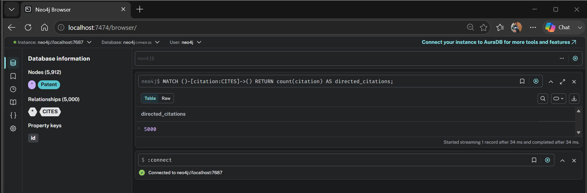

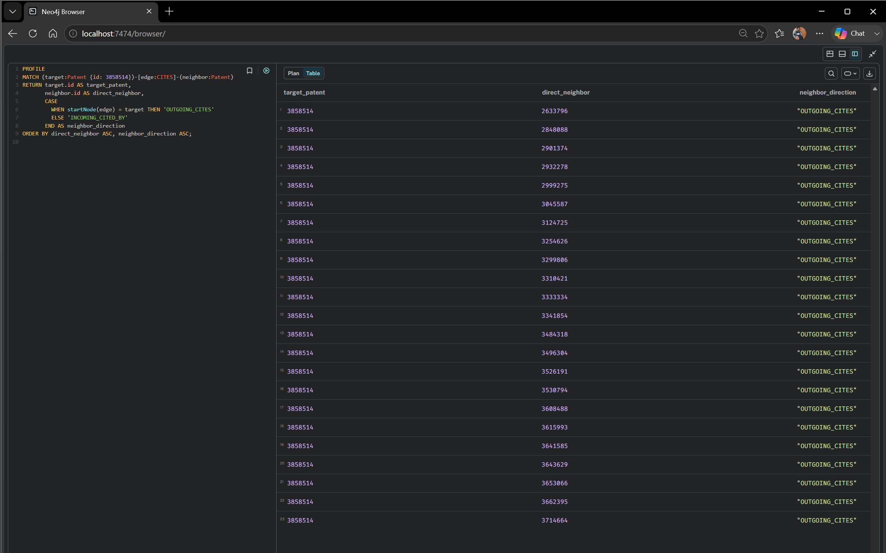

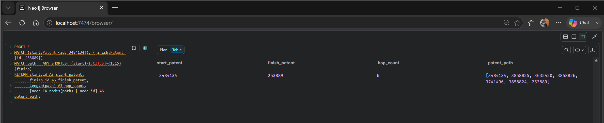

---

## Task 5: Theoretical Foundations & Future Engineering Trends
**Objective:** Scoped narrative literature review on data governance and advanced computing paradigms.

This component (detailed in `task5-literature-review.md`) delivers a narrative synthesis of theoretical constructs impacting modern data engineering:

1. **Enterprise Data Governance:** Compares centralized Data Lakes with decentralized Data Mesh architectures and Data Contracts. It covers how metadata tagging aids in GDPR/CCPA compliance, acknowledging that deletion rights contain exceptions and are not always "complete," and explains that while metadata lineage tracks data flows, access/audit logs are required to determine exactly who accessed data.
2. **Emerging Frontiers:** Analyzes Quantum Machine Learning (QML) and Large Language Model (LLM)-driven data engineering cycles. It explores how LLM code-generation variability poses a distinct challenge from Spark/Flink's exactly-once requirements (which depend on checkpointing, replayable sources, and transactional or idempotent sinks). It discusses self-healing ETL as a prospective application rather than a demonstrated result in the cited review.
